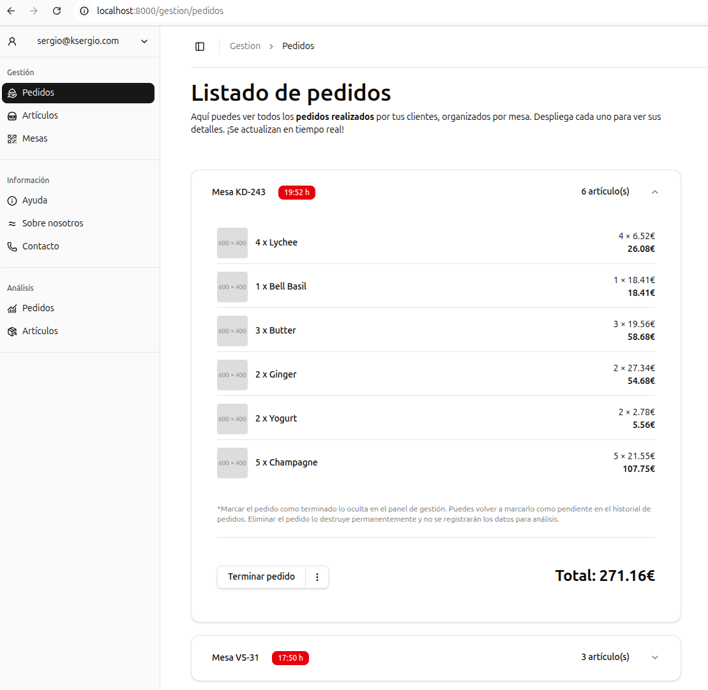
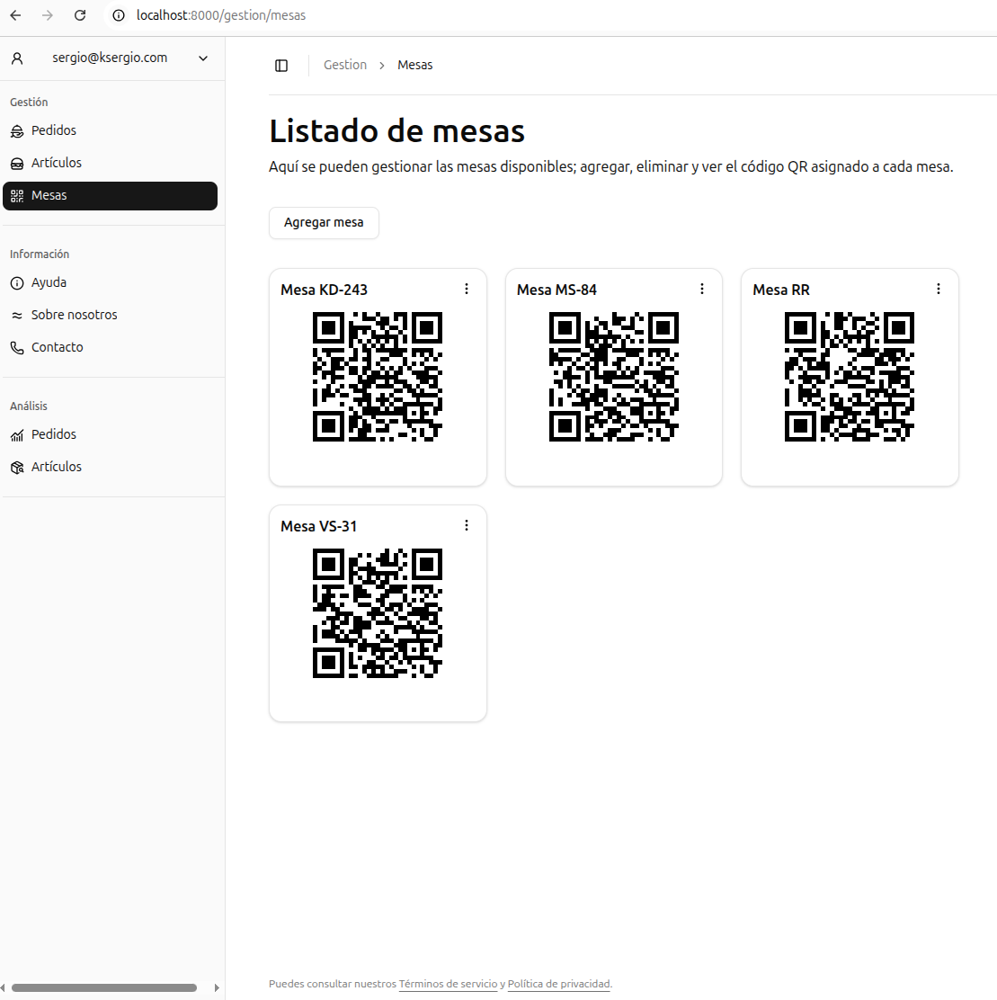

# pedidosqr.com
### Laravel + React + WebSockets


Proyecto SaaS para mandar pedidos por **WebSockets**. Sigue en desarollo. Voy agregando pequeñas mejoras y hay alguna idea que todavía está en desarollo.

Esta es una versión de prueba que realmente funciona, pero siguen faltando funcionalidades.

Utilizo la librería **shadcn/ui** para los componentes del dashboard. El resto de los estilos están ajustados y personalizados con **Tailwindcss**.

Se ha agregado un panel de administracion hecho con **Filament**.

<table>
  <tr>
    <td></td>
    <td></td>
  </tr>
</table>

---

## ¿Cómo desplegar sin herramientas? *(a pelo)*

### Requisitos básicos

Laravel requiere algunas extensiones y versiones mínimas de PHP:

- PHP >= 8.2
- Ctype PHP Extension
- cURL PHP Extension
- DOM PHP Extension
- Fileinfo PHP Extension
- Filter PHP Extension
- Hash PHP Extension
- Mbstring PHP Extension
- OpenSSL PHP Extension
- PCRE PHP Extension
- PDO PHP Extension
- Session PHP Extension
- Tokenizer PHP Extension
- XML PHP Extension

Además, se necesita un driver de base de datos:  
`SQLite`, `MySQL` o `PostgreSQL`, según tu entorno de producción.

Para mejorar la gestión del event loop y despacho de eventos, instala:  
```bash
pecl install uv
```

Revisa la documentación de [Laravel Reverb](https://laravel-reverb.com) para aumentar la cantidad de conexiones permitidas en Nginx.

---

### Ajustes con variables de entorno

Configura tus variables de entorno adecuadamente. Ejemplo para usar puerto 443 con Reverb y desactivar debug:

```env
APP_DEBUG=false
APP_URL=https://midominio.com

REVERB_APP_ID=tu_app_id
REVERB_APP_KEY=tu_app_key
REVERB_APP_SECRET=tu_app_secret
REVERB_HOST=midominio.com
REVERB_PORT=443
REVERB_SCHEME=https
```

---

### Instalaciones y configuraciones básicas

Ejecuta estos comandos para preparar el proyecto y levantar los servicios:

```bash
composer install
npm run build
php artisan optimize
php artisan rever:start
php artisan queue:work
php artisan storage:link
```

---

### Configuración de systemd para servicios Reverb y queue worker

Crea los siguientes archivos para asegurar que los servicios corran siempre:

#### `/etc/systemd/system/reverb.service`

```ini
[Unit]
Description=Laravel Reverb WebSocket Server
After=network.target

[Service]
User=www-data
WorkingDirectory=/ruta/al/proyecto/
ExecStart=/usr/bin/php /ruta/al/proyecto//artisan rever:start
Restart=always
RestartSec=5s

[Install]
WantedBy=multi-user.target
```

#### `/etc/systemd/system/queue-worker.service`

```ini
[Unit]
Description=Laravel Queue Worker
After=network.target

[Service]
User=www-data
WorkingDirectory=/ruta/al/proyecto/
ExecStart=/usr/bin/php /ruta/al/proyecto//artisan queue:work --sleep=3 --tries=3
Restart=always
RestartSec=5s

[Install]
WantedBy=multi-user.target
```

Luego habilita y levanta los servicios:

```bash
sudo systemctl daemon-reload
sudo systemctl enable reverb.service
sudo systemctl start reverb.service

sudo systemctl enable queue-worker.service
sudo systemctl start queue-worker.service
```

---

### Configuración de Nginx

Aquí tienes un ejemplo básico para servir Laravel y proxy para WebSockets en Reverb:

```nginx
server {
    server_name midominio.com;

    root /ruta/al/proyecto//public;

    index index.php index.html index.htm;

    # Servir archivos estáticos directamente desde public
    location /build/ {
        try_files $uri $uri/ =404;
    }

    location / {
        # Para Laravel (PHP)
        try_files $uri $uri/ /index.php?$query_string;
    }

    # Proxy para WebSockets u otras apps que corran en 127.0.0.1:8080
    location /app {
        proxy_http_version 1.1;
        proxy_set_header Host $host;
        proxy_set_header Upgrade $http_upgrade;
        proxy_set_header Connection "Upgrade";
        proxy_pass http://127.0.0.1:8080/app;
        proxy_read_timeout 86400;
        proxy_send_timeout 86400;
    }

    # PHP-FPM
    location ~ \.php$ {
        fastcgi_pass unix:/var/run/php/php8.2-fpm.sock;
        fastcgi_param SCRIPT_FILENAME $realpath_root$fastcgi_script_name;
        include fastcgi_params;
        fastcgi_hide_header X-Powered-By;
    }

    listen 80;
}
```

---

## ¿Qué necesito para desarrollar y correr?

1. Servir la app Laravel:  
   ```bash
   php artisan serve
   ```
2. Levantar servidor WebSockets (Reverb):  
   ```bash
   php artisan rever:start
   ```
3. Levantar worker para la cola de eventos:  
   ```bash
   php artisan queue:work
   ```
4. Crear enlace simbólico para servir imágenes:  
   ```bash
   php artisan storage:link
   ```

5. Corre las migraciones y opcionalmente el seeder
   ```bash
   php artisan migrate:fresh --seed
   ```

6. Build y optimiza los recursos
    ```bash
    npm run build
    php artisan optimize
    php artisan filament:optimize
    ```